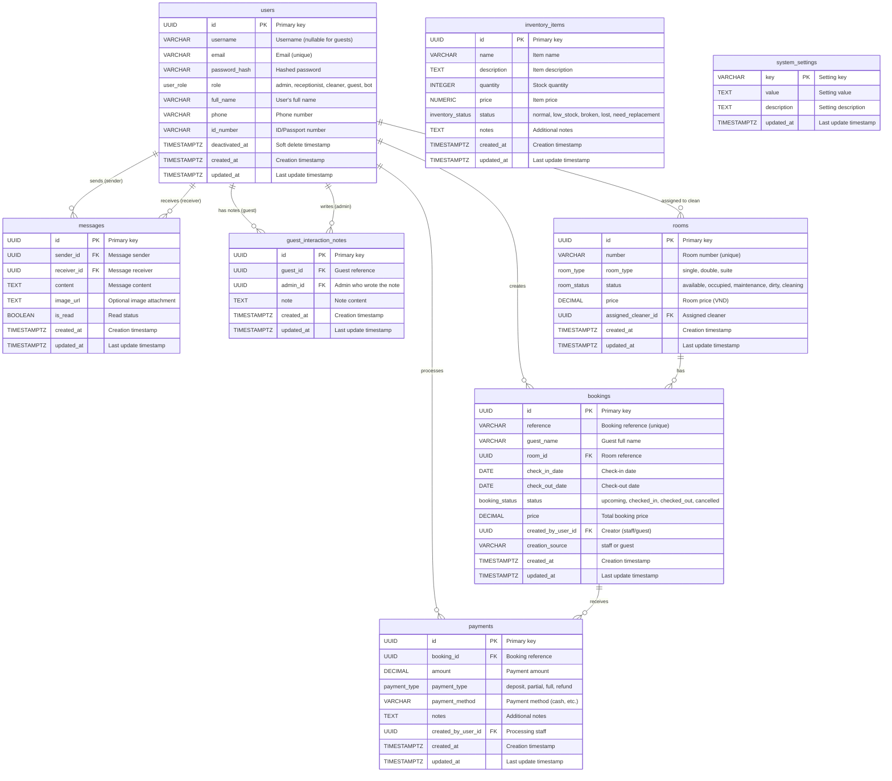

# Pupinn Hotel Management System - Database Schema

This document provides a comprehensive overview of the Pupinn hotel management system database schema, including entity relationships and detailed explanations.

## Database Schema Diagram

The following Entity Relationship Diagram (ERD) illustrates the complete database structure:

## Schema Overview

The Pupinn database schema is designed to support a comprehensive hotel management system with role-based access control, booking management, payment processing, internal messaging, inventory tracking, and AI-powered assistance.

### Core Entities

#### 1. Users Table
The central entity managing all system users across different roles:

- **Roles**: Supports five distinct roles:
  - `admin`: System administrator with full access
  - `receptionist`: Front desk staff managing bookings and guests
  - `cleaner`: Housekeeping staff responsible for room maintenance
  - `guest`: Hotel guests who can create bookings and communicate via chat
  - `bot`: AI assistant (Pupinn) for automated interactions

- **Features**:
  - Flexible authentication supporting both username/email login
  - Soft deletion via `deactivated_at` timestamp
  - PII tracking (phone, ID number) for guests
  - Enforces single admin constraint via database triggers

#### 2. Rooms Table
Manages hotel room inventory and status:

- **Room Types**: `single`, `double`, `suite`
- **Room Statuses**: 
  - `available`: Ready for booking
  - `occupied`: Currently booked
  - `maintenance`: Under repair
  - `dirty`: Needs cleaning
  - `cleaning`: Currently being cleaned

- **Features**:
  - Dynamic pricing per room
  - Cleaner assignment for housekeeping workflow
  - Unique room numbers for easy identification

#### 3. Bookings Table
Central to the reservation system:

- **Booking Statuses**: `upcoming`, `checked_in`, `checked_out`, `cancelled`
- **Features**:
  - Unique booking reference codes
  - Date validation (check-out must be after check-in)
  - Tracks creation source (staff vs guest portal)
  - Links to creator for audit trail
  - Stores booking price at time of reservation

#### 4. Payments Table
Comprehensive payment tracking:

- **Payment Types**: 
  - `deposit`: Initial booking deposit
  - `partial`: Partial payment
  - `full`: Full payment
  - `refund`: Refund transaction

- **Features**:
  - Supports multiple payments per booking
  - Tracks payment method and processing staff
  - Validates refund amounts (can be negative)
  - Cascade deletion with bookings

#### 5. Messages Table
Internal communication system:

- **Features**:
  - Direct messaging between any users
  - Image attachment support via URL
  - Read/unread status tracking
  - Enables guest-staff and staff-staff communication
  - AI bot integration for automated responses

#### 6. Inventory Items Table
Hotel inventory management:

- **Statuses**: `normal`, `low_stock`, `broken`, `lost`, `need_replacement`
- **Features**:
  - Stock quantity tracking
  - Price tracking for asset valuation
  - Custom notes for maintenance history

#### 7. Guest Interaction Notes Table
Administrative notes about guests:

- **Features**:
  - Private notes visible only to staff
  - Tracks which admin wrote each note
  - Helps maintain guest history and preferences
  - Supports personalized service

#### 8. System Settings Table
Configuration storage:

- **Features**:
  - Key-value store for system configuration
  - AI service settings (provider, API keys, models)
  - Flexible schema for adding new settings

## Key Relationships

### One-to-Many Relationships

1. **Users → Bookings**: A user (staff or guest) can create multiple bookings
2. **Rooms → Bookings**: A room can have multiple bookings over time
3. **Bookings → Payments**: A booking can have multiple payment transactions
4. **Users → Payments**: A staff member can process multiple payments
5. **Users → Messages**: A user can send and receive multiple messages
6. **Users → Rooms**: A cleaner can be assigned to multiple rooms
7. **Users → Guest Notes**: Guests can have multiple notes; admins can write multiple notes

## Database Constraints & Business Rules

### Data Integrity

1. **Date Validation**: Check-out date must be after check-in date
2. **Price Validation**: Room and booking prices must be non-negative
3. **Payment Validation**: Refunds can be negative; other payment types must be positive
4. **Single Admin Rule**: Only one active admin account allowed (enforced by trigger)
5. **Cascade Deletion**: Deleting a booking removes associated payments and messages

### Indexes

The schema includes strategic indexes for:
- User lookups (username, email, role)
- Room status and number queries
- Booking reference and date range searches
- Payment tracking by booking
- Message conversation queries
- Guest note retrieval

### Automatic Timestamps

All tables include:
- `created_at`: Automatically set on record creation
- `updated_at`: Automatically updated via database triggers

## Enum Types

The schema uses PostgreSQL ENUM types for type safety:

- **user_role**: `admin`, `receptionist`, `cleaner`, `guest`, `bot`
- **room_type**: `single`, `double`, `suite`
- **room_status**: `available`, `occupied`, `maintenance`, `dirty`, `cleaning`
- **booking_status**: `upcoming`, `checked_in`, `checked_out`, `cancelled`
- **payment_type**: `deposit`, `partial`, `full`, `refund`
- **inventory_status**: `normal`, `low_stock`, `broken`, `lost`, `need_replacement`

## Special Features

### AI Integration

The system includes a special bot user (Pupinn AI Assistant) with a fixed UUID (`00000000-0000-0000-0000-000000000000`) that participates in the messaging system to provide AI-powered room booking assistance and guest services.

### Soft Deletion

Users are soft-deleted via the `deactivated_at` timestamp, preserving historical data while preventing active use of the account.

### Audit Trail

The schema maintains comprehensive audit trails:
- Booking creators and creation sources
- Payment processors
- Note authors
- Automatic timestamp tracking

## Migration History

The schema was built incrementally through 14 migrations:
1. Initial users and roles
2. Rooms and room types
3. Bookings system
4. Guest support
5. User identifier constraints
6. Cleaner role and room statuses
7. Extended user fields and guest notes
8. Room pricing
9. Overstay status handling
10. Payment system
11. Cleaner assignment
12. Inventory management
13. Messaging system
14. AI features and system settings

This modular approach allows for easy schema evolution and rollback capabilities.
